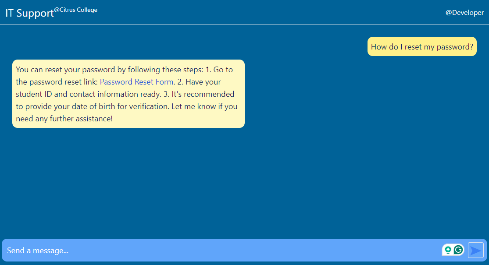

# TeCS AI Assistant
This AI-powered assistant helps users by answering questions that are commonly asked at the TeCS help desk. Built on React and Node.js, it integrates the OpenAI API to provide intelligent responses to user queries.
# Screenshots

# Technologies Used
- React
- Node.js
- Express
- OpenAI API
