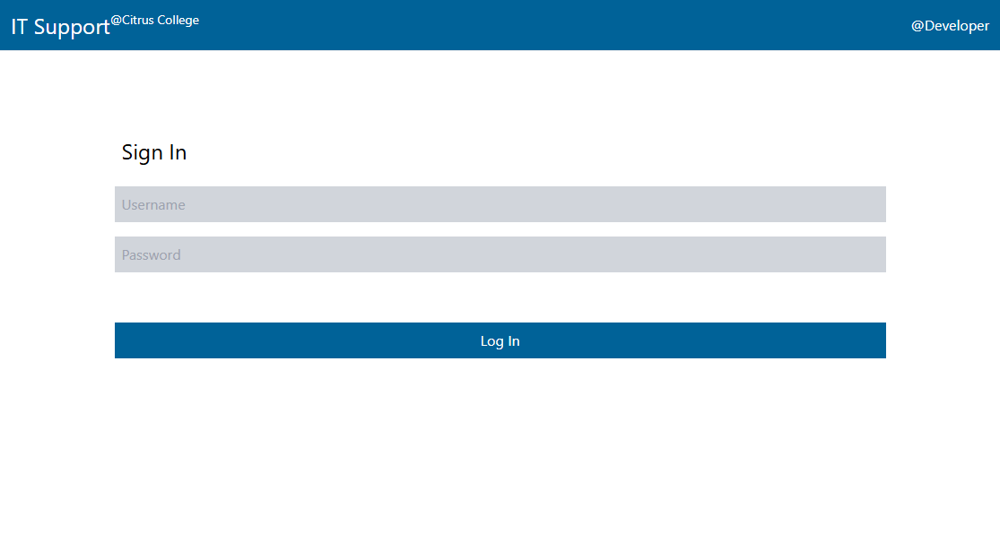
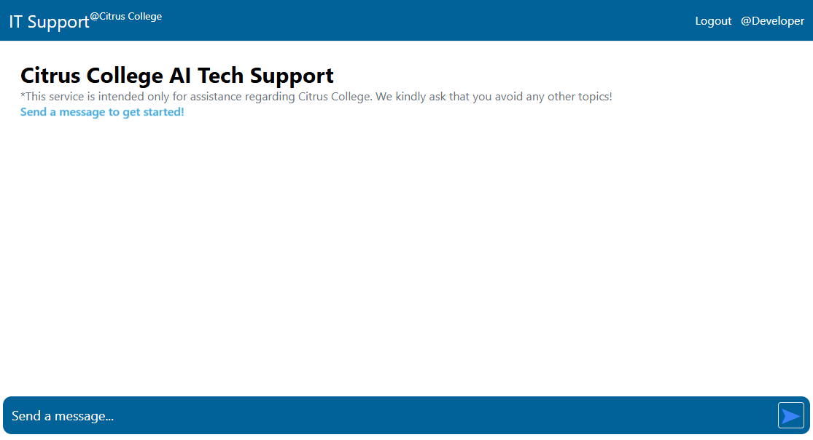
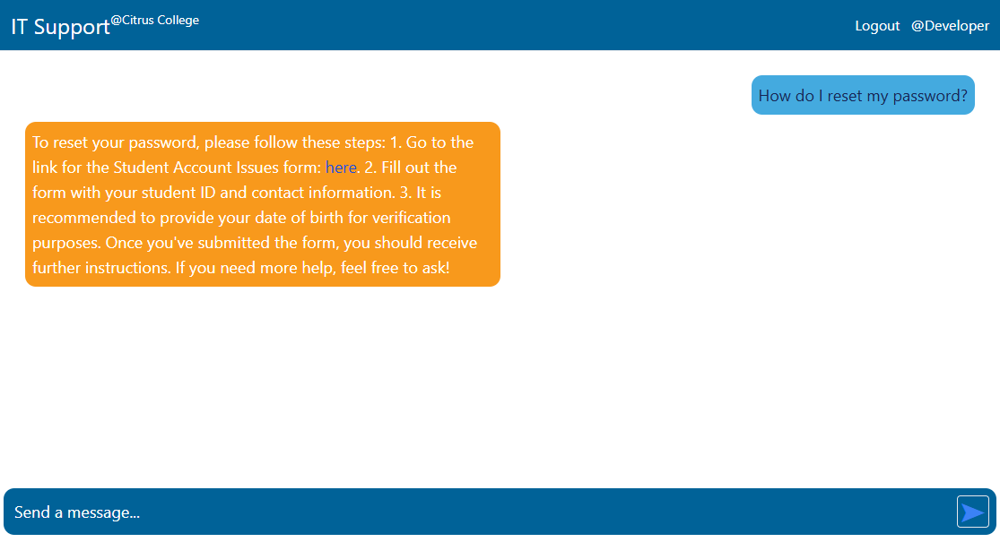

# TeCS AI Assistant
This AI-powered assistant helps users by answering questions that are commonly asked at the TeCS help desk. Built on React and Node.js, it integrates the OpenAI API to provide intelligent responses to user queries.

**Check out a small demo [here](https://itassistant.onrender.com/)!** (OpenAI's API takes a small fee for each token generated, so this demo is limited).

Username: testuser

Password: password123

## 📌 Features:
- AI-powered responses using the **OpenAI API** to generate helpful, context-aware answers.  
- Built with **React (Frontend) & Node.js (Backend)**.  
- Uses REST API architecture for client-server communication.  
- Includes **Vitest** for unit and integration testing.  
- Designed with **Tailwind CSS** for a clean UI.

## 🔧 Tech Stack:  
- React, Vite, and Tailwind CSS for the frontend  
- Node.js and Express.js for the backend  
- OpenAI API for AI integration  
- Vitest for testing and scalability

## 🚀 How It Works:  
1. The user enters a query (e.g., "How do I reset my student password?").  
2. Request sent to Node.js backend, which processes the query.  
3. OpenAI API generates a response.  
4. Response is sent back to the React frontend for display.  

## 📷 Screenshots

**Author:** Jonathan Woline | [GitHub](https://github.com/Literally-Code)
